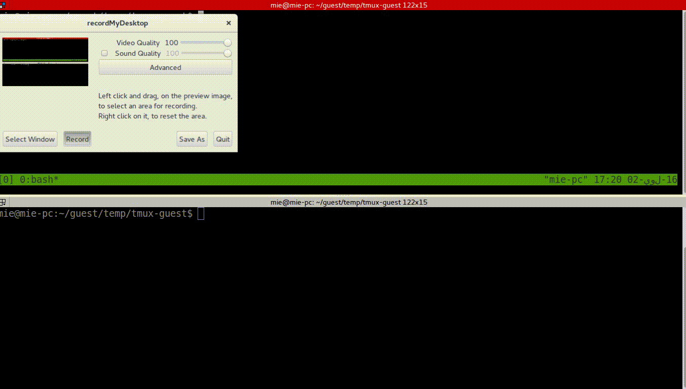

# Tmux Guest

A package to maniplate tmux spies



## Installation

Tmux Guest requires tmux to be installed

See [INSTALL](INSTALL) for detailed installation instructions.

## Usage

```bash
guest add myguest	# adds a username myguest
guest allow myguest	# allow myguest to spy on the user's sessions
guest kick myguest	# kick myguest out
guest deny myguest	# disallow myguest from spying
guest delete myguest	# remove user myguest
```

## License

[GPL](COPYING)

Copyright © 2016 [Mohamed Elawadi](https://github.com/mie00)
